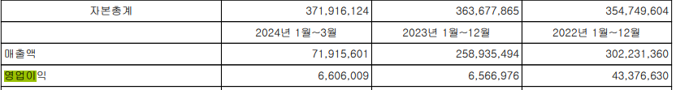

# DART 전자공시 사이트에서 재무제표 데이터 수집

이 Python 스크립트는 DART(데이터 분석, 검색 및 전송) API를 사용하여 특정 기업(이 경우 삼성전자)의 재무제표 데이터를 가져옵니다. 지정된 연도와 분기에 대한 재무제표를 검색한 후, 데이터를 별도의 Excel 파일로 분할 및 저장하여 분석을 용이하게 합니다.

## 필요 조건(라이브러리)

API 키 필요함(DART에서 API 키 받아야함)

pip install selenium fpdf matplotlib requests beautifulsoup4 pdfplumber dart-fss pandas

pip install webdriver-manager
pip install selenium
pip install fpdf
pip install matplotlib
pip install requests
pip install beautifulsoup4
pip install pdfplumber
pip install dart-fss
pip install pandas
pip install yfinance
pip install --upgrade requests urllib3

requests: HTTP 요청을 보내기 위한 라이브러리입니다.
beautifulsoup4: HTML 및 XML 파일을 파싱하기 위한 라이브러리입니다.
pdfplumber: PDF 파일에서 텍스트 및 데이터를 추출하기 위한 라이브러리입니다.
dart-fss: DART (Data Analysis, Retrieval and Transfer) API와 상호작용하기 위한 라이브러리입니다.
pandas: 데이터 분석 및 조작을 위한 라이브러리입니다.

## 사용방법

DART API 키 설정:
DART 웹사이트에서 API 키를 받아 스크립트 내 api_key 변수의 값을 해당 키로 설정합니다.

종목 목록 가져오기:
스크립트는 DART 플랫폼에 상장된 기업 목록을 가져옵니다.

삼성전자 찾기:
스크립트는 삼성전자의 기업 코드를 찾습니다.

재무제표 가져오기:
get_report 함수는 지정된 연도, 분기 및 재무제표 유형(CFS 또는 OFS)에 대한 재무제표 데이터를 가져옵니다.

데이터 분할 및 저장:
split_report 함수는 가져온 재무제표 데이터를 별도의 카테고리(재무상태표, 손익계산서, 현금흐름표, 포괄손익계산서, 자본변동표)로 분할하고 각각의 Excel 파일로 저장합니다.

예시 삼성전자 2024 1분기

PBR = 주가 / 순자산(주당 순자산 가치)